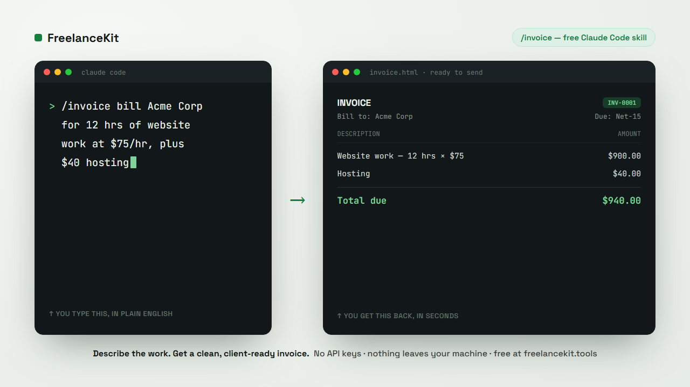

# Claude Code Freelancer Skills

Free, plug-and-play [Claude Code](https://docs.claude.com/en/docs/claude-code) skills for the admin half of freelancing — the invoices, proposals, and paperwork you didn't start freelancing to do.

The point isn't "another invoicing app." It's that the admin happens **where you already work** — the terminal. Describe the job in plain English, get the deliverable back, no context switch.



## Install

**As a Claude Code plugin** (recommended — native, versioned):

```
/plugin marketplace add ricardo-agent/freelancer-skills
/plugin install freelancekit@freelancekit
```

**Or with the skills CLI:**

```bash
npx skills add ricardo-agent/freelancer-skills
```

Then just describe the work in plain English and let the skill do the rest.

> Not using Claude Code? The same tools run free in your browser — no signup, nothing leaves your machine: **[freelancekit.tools](https://freelancekit.tools)**

## Included (free)

### `/invoice`
Describe the work — *"12 hrs website fixes at $75/hr for Acme, plus $40 hosting"* — and get a clean, client-ready invoice back as **HTML** (paste straight into an email) and **Markdown** (for your records). No API keys, no config, nothing leaves your machine.

## The full pack

`/invoice` is 1 of **7** skills in the **Claude Code Freelancer Pack**. The rest handle the other admin that eats your evenings:

| Skill | What it does |
|---|---|
| `/proposal` | Job post or call notes → a tight, client-ready proposal built to win the work |
| `/meeting` | Messy notes or a transcript → summary + action-item table + follow-up email |
| `/redline` | A contract or SOW → the risky clauses flagged in plain English before you sign |
| `/outreach` | A prospect → a personalized 3-touch cold email/LinkedIn sequence |
| `/scopecheck` | A new client ask vs. your original scope → a verdict + a ready-to-send reply |
| `/setrate` | A target income → an hourly rate or project price, with the math shown |

**See the real, unedited output** these produce before you decide — a full contract red-line and a client-ready proposal: **[freelancekit.tools/examples](https://freelancekit.tools/examples/)**

**Get all 7 →** https://agentia11.gumroad.com/l/dukuod

One-time, no subscription. Early-adopter price **$15** (list $27). If it doesn't save you time, it's covered by a 30-day money-back guarantee.

## License

The free `/invoice` skill in this repo is free to use, read, and adapt for your own client work.
